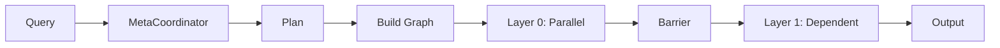

# Magentic Architecture

> 🖼️ See [architecture_diagram.svg](architecture_diagram.svg) for visual overview.

## Overview

Magentic dynamically generates agent networks per query using AI-driven planning.

```
User Query → Meta-Coordinator → Dynamic Agent Plan → LangGraph Execution → Output
                   ↓
            Analyzes complexity, selects roles, defines dependencies
```

## Layers

| Layer | Components | Purpose |
|-------|------------|---------|
| **Frontend** | React, WebSocket | Real-time UI, agent visualization |
| **API** | FastAPI | REST + WebSocket endpoints |
| **Coordination** | MetaCoordinator | Query analysis, plan generation |
| **Execution** | LangGraph | State management, parallel execution |
| **Agents** | MetaAgentSystem | Agent orchestration, tool access |
| **RAG** | Qdrant/Chroma | Vector search, document retrieval |

## Execution Flow



## Key Concepts

### Dynamic Topology
Each query gets a unique agent configuration:
- "Hi" → 1 agent
- "Compare X vs Y" → 2 researchers + 1 synthesizer

### Layer Barriers
Synchronization points ensuring all agents in layer N complete before layer N+1 starts.

### Parallel Execution
Agents without dependencies run concurrently within the same layer.

## Directory Structure

```
src/
├── agents/          # System, executor, LLM factory
├── coordinator/     # Planner, validators, prompts
├── execution/       # Graph builder, state, nodes
├── services/        # MCP client, RAG
├── tools/           # Tool manager
└── ui/              # Visualization
frontend/src/
├── components/      # UI components
├── hooks/           # useWebSocket
└── contexts/        # Auth
```
