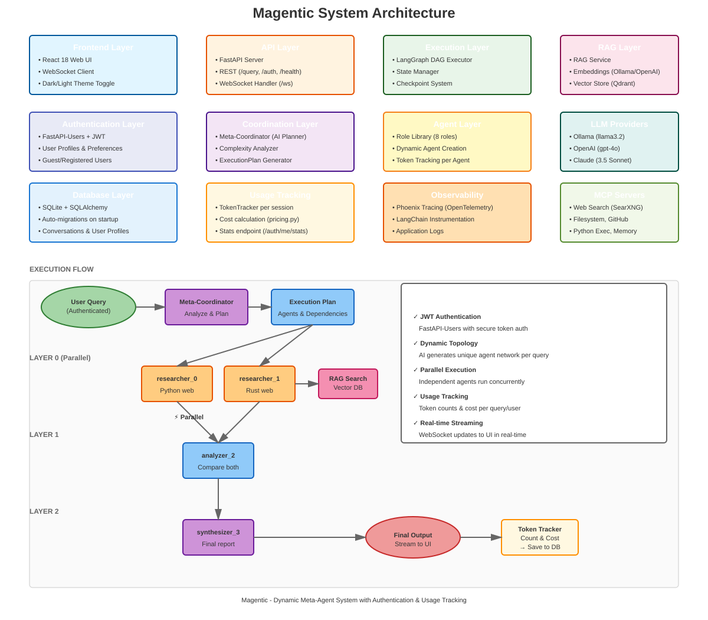

Magentic Documentation
======================

**Magentic** is a dynamic meta-agent system that coordinates multiple AI agents
to solve complex queries. It uses LangGraph for orchestration, supports multiple
LLM providers, and includes comprehensive authentication and usage tracking.

Key Features
------------

* **Dynamic Agent Topology** - AI generates unique agent networks per query
* **Parallel Execution** - Independent agents run concurrently via LangGraph
* **JWT Authentication** - Secure user authentication with FastAPI-Users
* **Usage Tracking** - Token counts and cost tracking per query/user
* **Real-time Streaming** - WebSocket updates to UI in real-time
* **Multiple LLM Providers** - Ollama, OpenAI, Anthropic Claude
* **RAG Integration** - Vector search with Qdrant
* **Observability** - Phoenix tracing with OpenTelemetry

Quick Links
-----------

* **Source Code**: `GitHub Repository <https://github.com/your-org/magentic>`_
* **API Docs**: :doc:`api/index`
* **Architecture**: :doc:`ARCHITECTURE`

.. toctree::
   :maxdepth: 2
   :caption: User Guide

   README
   AUTHENTICATION
   OBSERVABILITY

.. toctree::
   :maxdepth: 2
   :caption: Technical Reference

   ARCHITECTURE
   RAG_AND_TOOLS

.. toctree::
   :maxdepth: 2
   :caption: API Reference

   api/index
   api/modules

Indices and tables
==================

* :ref:`genindex`
* :ref:`modindex`
* :ref:`search`
