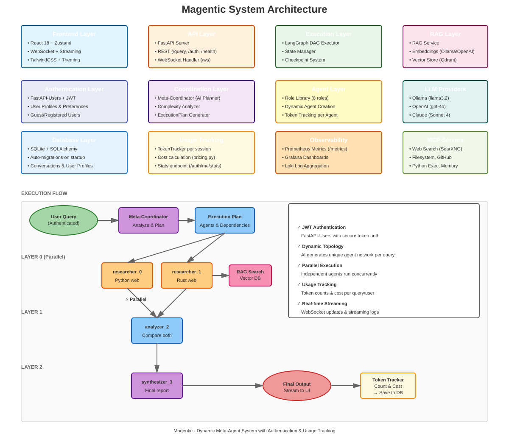

Magentic Documentation
======================

**Dynamic multi-agent AI orchestration with parallel execution.**

Why Magentic?
-------------

Traditional AI assistants use one model for every task. Magentic acts as an **AI orchestrator** — it analyzes your question, breaks it into components, and deploys specialized agents to tackle each part. A research question spawns researchers and analyzers working in parallel; a coding task uses a planner, coder, and critic in sequence.

Quick Start
-----------

.. code-block:: bash

   git clone https://github.com/amirsdream/Magentic.git && cd Magentic
   chmod +x magentic.sh && ./magentic.sh setup
   ./magentic.sh start
   # Open http://localhost:3000

Features
--------

.. list-table::
   :widths: 20 80
   :header-rows: 1

   * - Feature
     - Description
   * - 🤖 **Dynamic Planning**
     - AI creates optimal agent networks per query
   * - ⚡ **Parallel Execution**
     - Agents run simultaneously via LangGraph DAG
   * - 🔍 **Web Search**
     - Real-time information retrieval
   * - 📚 **RAG Support**
     - Query your own documents
   * - 🎨 **Real-time UI**
     - Live execution visualization with WebSocket streaming
   * - 🔐 **User Auth**
     - JWT authentication with conversation history
   * - 📊 **Usage Tracking**
     - Token usage and cost tracking per user
   * - 🔭 **Observability**
     - Prometheus, Grafana, Loki integration

Supported LLMs
--------------

* **Ollama** — Local, free (llama3.2, mistral, etc.)
* **OpenAI** — GPT-4o, GPT-4-turbo
* **Claude** — Claude Sonnet 4, Claude 3.5

Commands
--------

.. code-block:: bash

   ./magentic.sh setup      # First-time setup
   ./magentic.sh start      # Start all services
   ./magentic.sh stop       # Stop all services
   ./magentic.sh status     # Show service status
   ./magentic.sh cli        # Interactive CLI mode
   ./magentic.sh help       # Show all commands

Agent Roles
-----------

.. list-table::
   :widths: 20 80
   :header-rows: 1

   * - Role
     - Description
   * - **Researcher**
     - Web search for current information
   * - **Retriever**
     - Knowledge base search (RAG)
   * - **Analyzer**
     - Data analysis and explanations
   * - **Planner**
     - Step-by-step planning
   * - **Writer**
     - Articles and documentation
   * - **Coder**
     - Code generation and explanation
   * - **Critic**
     - Review and improvement
   * - **Synthesizer**
     - Combine inputs into final output

Execution Flow
--------------

.. code-block:: text

   Query → RAG Context → Meta-Coordinator → Execution Plan → LangGraph DAG
                                                 ↓
                          Layer 0: [researcher_0, researcher_1] (parallel)
                                                 ↓ barrier
                          Layer 1: [analyzer_2]
                                                 ↓ barrier
                          Layer 2: [synthesizer_3] → Final Output
                                                 ↓
                                       WebSocket → React UI

Tech Stack
----------

.. list-table::
   :widths: 30 70
   :header-rows: 1

   * - Component
     - Technology
   * - Orchestration
     - LangGraph (DAG, checkpointing)
   * - Backend
     - FastAPI + WebSocket
   * - Auth
     - FastAPI-Users + JWT
   * - Frontend
     - React 18 + Zustand + TailwindCSS
   * - Database
     - SQLAlchemy + SQLite
   * - RAG
     - Qdrant / ChromaDB
   * - MCP
     - Docker + FastMCP
   * - Observability
     - Prometheus + Grafana + Loki

Links
-----

* � `Documentation <https://amirsdream.github.io/Magentic/>`_ (GitHub Pages)
* �🐙 `GitHub <https://github.com/amirsdream/Magentic>`_
* 🐛 `Issues <https://github.com/amirsdream/Magentic/issues>`_

API Documentation
-----------------

When the server is running, interactive API documentation is available:

* **Swagger UI**: http://localhost:8000/docs — Interactive API testing
* **ReDoc**: http://localhost:8000/redoc — Clean API reference
* **OpenAPI JSON**: http://localhost:8000/openapi.json — Machine-readable spec

Guides
------

* `Architecture <https://github.com/amirsdream/Magentic/blob/main/docs/ARCHITECTURE.md>`_ — System design, execution flow
* `Authentication <https://github.com/amirsdream/Magentic/blob/main/docs/AUTHENTICATION.md>`_ — JWT auth, usage stats
* `Observability <https://github.com/amirsdream/Magentic/blob/main/docs/OBSERVABILITY.md>`_ — Prometheus, Grafana, Loki
* `RAG & Tools <https://github.com/amirsdream/Magentic/blob/main/docs/RAG_AND_TOOLS.md>`_ — RAG setup, MCP integration

.. toctree::
   :maxdepth: 2
   :caption: Getting Started

   quickstart
   self

.. toctree::
   :maxdepth: 2
   :caption: API Reference

   api/index
   api/modules

Indices
-------

* :ref:`genindex`
* :ref:`modindex`
* :ref:`search`
